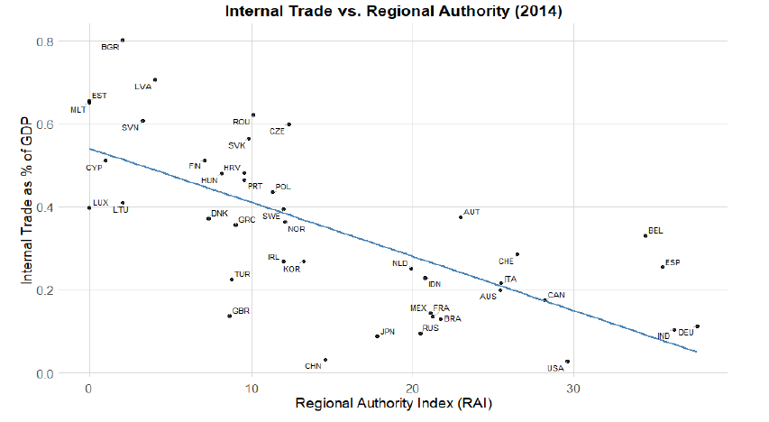

# Internal Trade to GDP  
### Political Decentralization and Domestic Market Integration

 *Applied econometric analysis using real-world cross-country data to examine how political decentralization affects internal trade intensity.*

---

## Project Overview
This project analyzes the relationship between **political decentralization** and **internal trade as a share of GDP** across countries.  
Internal trade reflects domestic market integration and economic coordination, while political decentralization captures the degree of authority held by subnational governments.

Using cross-country data and econometric analysis in **R**, this project evaluates whether higher regional authority is associated with weaker internal economic integration.

---

## Research Question
- Does greater political decentralization reduce internal trade as a share of GDP?
- How do institutional structures influence domestic economic integration?

---

## Data Sources
The analysis combines multiple authoritative international datasets:

- **World Input-Output Database (WIOD)**  
  Measures interregional trade flows within countries across industries.
- **Regional Authority Index (RAI)**  
  Quantifies political decentralization and regional autonomy.
- **World Bank Open Data**  
  Provides macroeconomic controls including GDP per capita, population, and land area.

The final dataset includes **42 countries**, analyzed as a cross-sectional sample for **2014**.

---

## Methodology
- Merged and cleaned multi-source international datasets using **R**
- Constructed internal trade intensity as internal trade divided by national GDP
- Estimated multiple linear regression models with:
  - Dependent variable: Internal trade (% of GDP)
  - Key independent variable: Regional Authority Index (RAI)
  - Controls: GDP per capita, population, land area
- Conducted robustness checks including nonlinear income specifications and outlier exclusion

---

## Key Model
𝐼𝑛𝑡𝑒𝑟𝑛𝑎𝑙𝑇𝑟𝑎𝑑𝑒𝑖=𝛽𝑜 +𝛽1𝑅𝐴𝐼𝑖+𝛽2𝐺𝐷𝑃𝑝𝑐𝑖+𝛽3𝑃𝑜𝑝𝑖+𝛽4𝐿𝑎𝑛𝑑𝑖+ 𝜀𝑖
Where:
- i: indexes countries
- InternalTrade = internal trade as a share of GDP
- 𝜀𝑖: error term 
- RAI: regional authority index:
- GDPpc: GDP per capita
- Pop: Population
- Land: Land area (km²)

## Key Empirical Insight

*Scatter plot illustrating the negative relationship between political decentralization (RAI) and internal trade as a share of GDP across 42 countries in 2014. The fitted regression line highlights a consistent downward trend.*

---

## Key Findings
- Higher levels of political decentralization are **consistently associated with lower internal trade intensity**
- The negative relationship remains statistically significant after controlling for economic development, population size, and geographic scale
- Robustness checks confirm that results are not driven by extreme observations or model specification choices

---

## Economic Interpretation & Implications
- Greater regional authority may introduce regulatory fragmentation, administrative barriers, or coordination challenges that weaken domestic market integration
- While decentralization can improve local governance and representation, it may impose trade-offs in terms of economic efficiency
- Findings highlight the importance of institutional coordination in sustaining integrated national markets

---

## Technical Skills
- Data cleaning and integration in **R**
- Cross-country data analysis
- Econometric modeling and robustness testing
- Translating statistical results into economic and policy insights

---

## Repository Contents
- `Group project code.R` — R script for data processing, regression analysis, and visualization
- `images/` — folder containing key visualization used in the analysis
- `Project Final Report.pdf` — full academic report with methodology and robustness checks

---

## Notes
This project focuses on analytical reasoning and empirical interpretation rather than prediction.  
It is designed to demonstrate applied economic analysis using real-world institutional and trade data.

